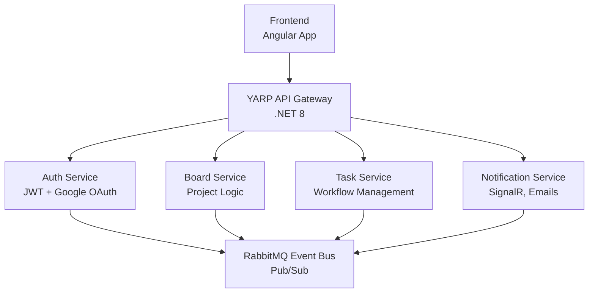

# 🧩 Project Management Platform

A a modern, cloud-ready Project Management System built with Angular and .NET 8 microservices architecture.
It allows teams to collaborate efficiently through boards, tasks, and real-time notifications, while maintaining a scalable and secure foundation.

---

## 🚀 Key Features

### 🔐 Authentication & Authorization
- JWT-based authentication and session handling.  
- Google OAuth 2.0 single click sign-in.  
- Role-based access control (Admin / Manager / Member).  
- Tenant-aware user management (automatic tenant provisioning on signup).

### 🗂 Project & Board Management
- Multi-project support and per-project boards.  
- Dynamic Kanban-style boards with customizable columns.  
- Task grouping, labels, priorities, due dates and assignment.  
- Activity tracking and audit trail for changes.

### ✅ Task Management
- Rich task model (title, description, assignee, priority, due date, comments).  
- Drag-and-drop status changes in the UI.  
- Commenting on tasks and threaded discussions.  
- Notifications for assignments, comments and status changes.

### 📡 Event-Driven Communication
- RabbitMQ as the central message bus (publish/subscribe).  
- MassTransit integration for reliable messaging and retries.  
- Decoupled services: events drive cross-service workflows (notifications, analytics, etc.).  
- Multiple consumers can independently react to the same event.

### 🔔 Real-Time Notifications
- SignalR for instant, user-specific real-time updates.  
- Email notifications for important events (SendGrid or similar).  
- Notifications only delivered to relevant users (assignee, watchers, tenant admins).

### ⚙️ Backend Architecture
- Modular microservices in **.NET 8** (Auth, Board, Task, Notification, etc.).  
- YARP as the API Gateway for routing, security and load balancing.  
- EF Core (and Dapper where needed) for data access; SQL Server as primary persistence.  
- MediatR and FluentValidation for clean CQRS-style handlers and request validation.

### ☁️ Deployment & DevOps
- Dockerfiles for all services; container-first design.  
- Kubernetes manifests / Helm charts for AKS deployment.  
- NGINX Ingress (or cloud LB) to expose the gateway.  
- CI/CD pipelines via Azure DevOps (build, test, push, deploy).

### 🧠 Scalability & Extensibility
- Services scale independently based on load.  
- Redis caching layer for performance improvements and short-lived state.  
- Architecture easily extended with new microservices (Reporting, Chat, Analytics).  
- Designed for future features: AI recommendations, advanced reporting, multi-language support.

---

## 🏗️ Simplified Architecture Overview

---

## 🛠️ Tech Stack

| Layer | Technology |
|-------|-------------|
| Frontend | Angular 20, PrimeNG |
| Backend | .NET 8 Web APIs |
| Gateway | YARP |
| Messaging | RabbitMQ + MassTransit |
| Database | SQL Server |
| Caching | Redis |
| Hosting | Azure AKS |
| CI/CD | Azure Pipelines |
| Auth | JWT + Google OAuth 2.0 |

---

## 🧰 Quick Start

### Prerequisites
- Node.js 20+  
- .NET 8 SDK  
- Docker Desktop  
- RabbitMQ & Redis  

### Local Setup
```bash
# Clone the repo
git clone https://github.com/yourusername/project-management-platform.git
cd project-management-platform

# Run services
docker-compose up --build

# Run frontend
git https://github.com/el2toro/pm-platform-fe.git
cd pm-platform-fe
npm install
ng serve

☁️ Deployment

Docker images pushed via Azure DevOps

Ingress NGINX routes external traffic to YARP Gateway

AKS manifests deployed via pipeline stages (Dev → QA → Prod)
